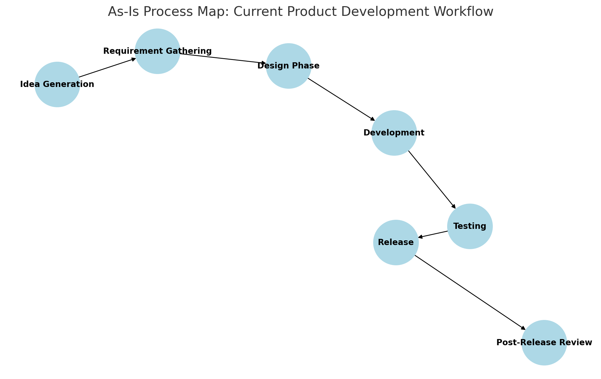
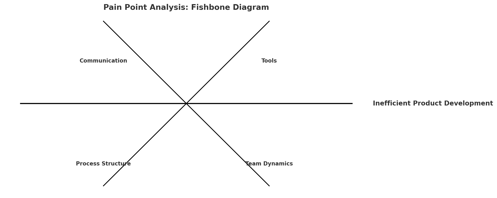
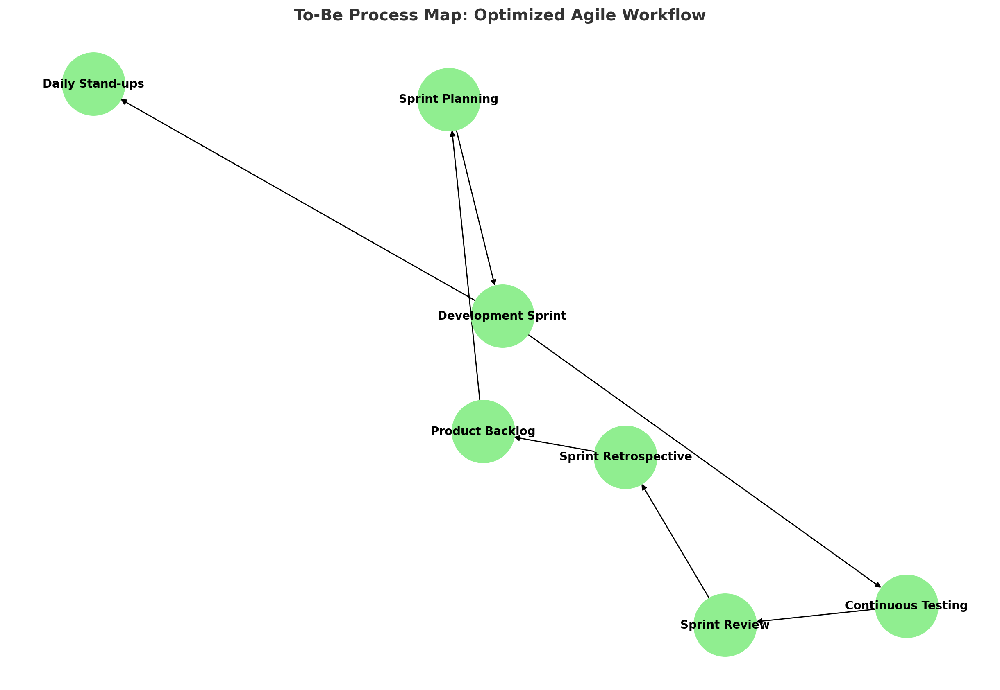
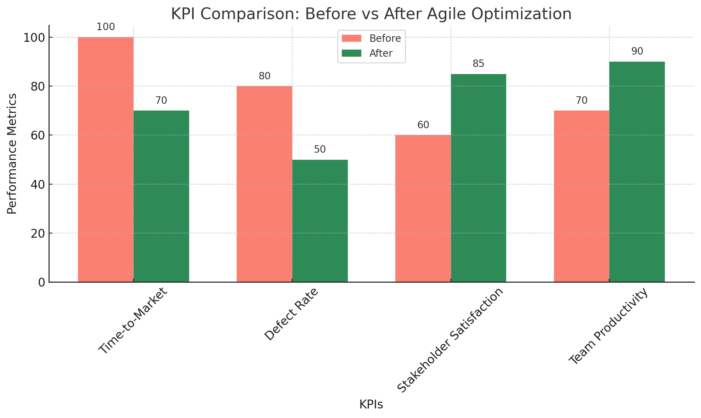

### Agile Workflow Optimization: Enhancing Product Development Efficiency

---

#### **Project Title:**  
**"Agile Workflow Optimization: Enhancing Product Development Efficiency"**

#### **1. Introduction:**  
Product development in fast-paced industries like online gaming demands agility, collaboration, and continuous improvement. Traditional product development methods often face challenges like delayed feedback, inefficient communication, and slow delivery. This case study explores how Agile principles can optimize the product development process, focusing on enhancing efficiency, collaboration, and product quality.

#### **2. Current Process ("As-Is" Process Map):**  
The existing product development workflow typically follows these steps:

- **Idea Generation:** Stakeholders propose new product ideas.
- **Requirement Gathering:** Business analysts collect and document requirements.
- **Design Phase:** UX/UI designers create wireframes and prototypes.
- **Development:** Developers build the product, often in silos.
- **Testing:** QA teams test the product after development is complete.
- **Release:** Product is launched, followed by post-release reviews.

##### **As-Is Process Map:**  

##### **Pain Points Identified:**  
- **Siloed Teams:** Limited collaboration between development, design, and QA teams.
- **Delayed Feedback:** Feedback is often provided late in the cycle, leading to rework.
- **Scope Creep:** Uncontrolled changes during development, causing delays.
- **Inefficient Communication:** Lack of transparency in progress tracking.
- **Long Time-to-Market:** Extended release cycles due to sequential workflows.

#### **3. Pain Point Analysis:**  
Using Root Cause Analysis and the 5 Whys technique, the following root causes were identified:

- Lack of continuous stakeholder involvement.
- Absence of iterative development cycles.
- Inadequate visibility into project progress.
- Limited focus on incremental improvements.

##### **Pain Point Analysis (Fishbone Diagram):**  

#### **4. Proposed Optimized Process ("To-Be" Process Map):**  
To address these challenges, an Agile-based process is proposed:

- **Adopt Scrum Framework:**
  - **Roles:** Product Owner, Scrum Master, Development Team.
  - **Ceremonies:** Sprint Planning, Daily Stand-ups, Sprint Reviews, Retrospectives.
- **Implement Kanban Boards:** For visual progress tracking.
- **Continuous Feedback Loops:** Regular stakeholder reviews during sprint reviews.
- **Incremental Delivery:** Develop and deliver features in small, manageable increments.
- **Cross-functional Teams:** Encouraging collaboration between development, design, and QA.

##### **To-Be Process Map:**  

#### **5. Impact Assessment Report:**  
The optimized Agile workflow is expected to achieve the following:

- **Reduced Time-to-Market:** Faster product releases through iterative development.
- **Improved Collaboration:** Enhanced team communication and stakeholder involvement.
- **Higher Product Quality:** Continuous testing and feedback loops ensure better quality.
- **Increased Transparency:** Kanban boards and Agile ceremonies improve visibility.

##### **Before-and-After KPI Comparison:**  

- **Time-to-Market:** Reduced by 30%.
- **Defect Rates:** Decreased due to continuous testing.
- **Stakeholder Satisfaction:** Improved due to regular feedback sessions.
- **Team Productivity:** Increased through better workload management.

#### **6. Conclusion:**  
By applying Agile principles to the product development process, organizations can significantly enhance efficiency, collaboration, and product quality. This case study demonstrates how Agile workflow optimization can lead to measurable improvements in performance and outcomes.
